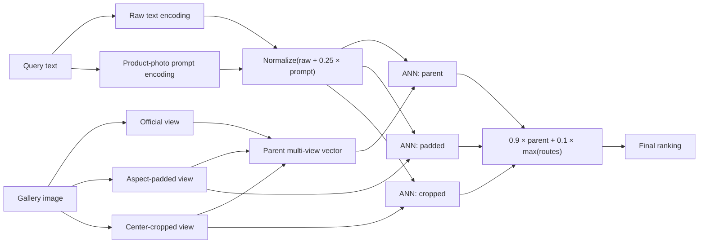

# 203M FashionSigLIP Multi-View Retrieval Architecture

## What the winning artifact is

The 4/6 result is a **FashionSigLIP-based retrieval system**, not a new set of
backbone weights. It keeps the official
`Marqo/marqo-fashionSigLIP` checkpoint unchanged and adds deterministic
multi-view encoding plus score-level late fusion.

Neural parameter count: **203,155,970**.

Learned parameters added: **0**.

Embedding dimension: **768**.

## Backbone

FashionSigLIP is a dual encoder:

- **vision tower:** SigLIP ViT-B/16 at 224×224 with MAP pooling;
- **text tower:** 12 transformer layers, width 768, 12 attention heads;
- **tokenizer:** 32K vocabulary with a 64-token context;
- **shared retrieval space:** normalized 768-dimensional image and text
  embeddings;
- **similarity:** cosine similarity.

The text and image towers are trained to place matching fashion descriptions
and images near one another. At serving time they run independently, so all
gallery image vectors can be computed offline.

## Query path

One query produces two temporary text encodings:

```text
q_raw     = FashionSigLIP(text)
q_prompt  = FashionSigLIP("a fashion product photo of " + text)

q = normalize(q_raw + 0.25 × q_prompt)
```

Only the final vector `q` is needed for retrieval.

## Gallery path

Each product image is encoded in three deterministic forms:

```text
d_official = FashionSigLIP(original image)
d_pad      = FashionSigLIP(aspect-preserving square-padded image)
d_crop     = FashionSigLIP(center-square-cropped image)

d_parent = normalize(
    d_official
    + 0.25 × d_pad
    + 0.25 × d_crop
)
```

The index stores `d_parent`, `d_pad`, and `d_crop`: three 768-D vectors per
gallery item.

## Retrieval and fusion

The same query vector searches all three indexes. Their cosine scores are
combined with the externally selected global rule:

```text
s_parent = cosine(q, d_parent)
s_pad    = cosine(q, d_pad)
s_crop   = cosine(q, d_crop)

final_score =
    0.9 × s_parent
    + 0.1 × max(s_parent, s_pad, s_crop)
```

This preserves the stable multi-view parent score while allowing a small
correction when padding or cropping exposes a product more clearly.



## Deployment cost

- one unchanged 203.16M neural checkpoint;
- one final query vector used across all routes;
- three gallery vectors and three ANN searches;
- about 4.5 KiB of raw FP16 vector storage per gallery item before index
  overhead;
- no online cross-encoder and no ensemble of neural backbones.

The tradeoff is therefore retrieval storage and ANN work, not neural parameter
growth.

## Valid claim

This architecture produced statistically significant full-corpus MAP@10 wins
over official FashionSigLIP on KAGL, Fashion200K, DeepFashion-InShop, and
Polyvore. Atlas and DeepFashion-Multimodal improved numerically but were
statistically inconclusive.

The accurate claim is:

> A 203M-parameter FashionSigLIP-based retrieval system significantly
> outperforms official FashionSigLIP on 4 of 6 evaluated text-to-image
> benchmarks, improves the point estimate on all 6, and loses on none.

It should not be described as a new standalone checkpoint, a 6/6 win, or a
fresh independent SOTA evaluation.
