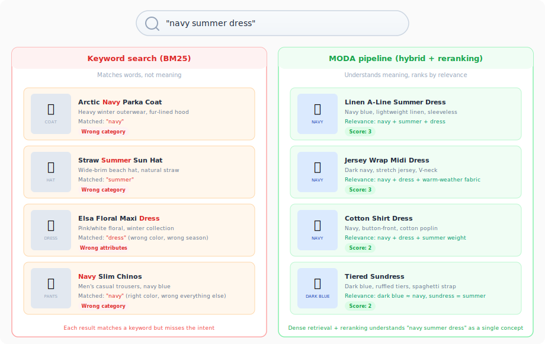
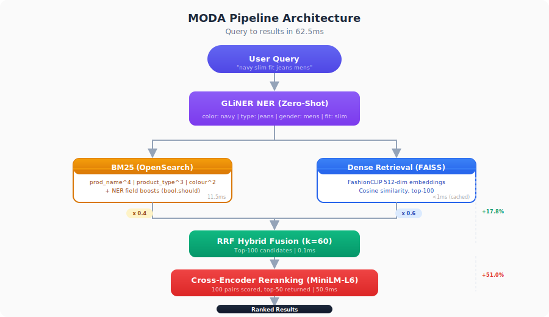
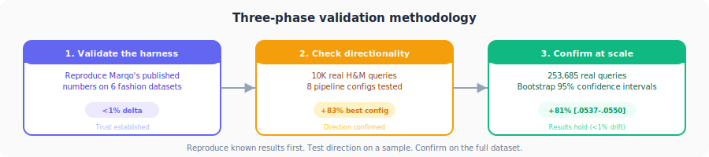
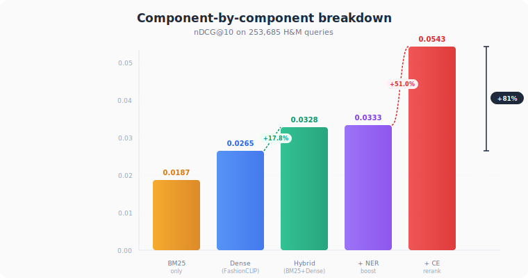

# Open benchmark harness for fashion search

*Even zero extra training can give you >75% gains.*

---

If you search "navy summer dress" on most fashion sites, you'll get results that include navy winter coats, summer hats, and random dresses that happen to have "navy" somewhere in the description. The search bar looks simple. The problem behind it is not. When you talk about Search infrastructure, Fashion might not be the first thing to come to your mind but it happens to be the hardest of the search problems that exist. Fashion is visual and yes people search for even vibes!

Fashion search is harder than general e-commerce search, and almost nobody talks about why. A furniture store sells a "walnut mid-century coffee table" and customers search for "walnut mid-century coffee table." The words match. Fashion doesn't work that way. H&M names a hoodie "Ben zip hoodie." Nobody searches for "Ben." They search for "zip hoodie" or "black hoodie mens" or just "hoodie." There's a gap between how products are named and how people look for them, and it's wider in fashion than anywhere else.

We wanted to measure that gap. More specifically, we wanted to know: if you take the best available tools and assemble a complete search pipeline, component by component, how much does each piece actually contribute? And can you do this without training any custom models, for starters atleast?

Nobody had published those numbers in a manner where people can run their own benchmarks. [Marqo](https://www.marqo.ai/) has open-source fashion embedding models ([FashionCLIP and FashionSigLIP](https://github.com/marqo-ai/marqo-FashionCLIP)) with benchmark results on academic datasets. [Algolia](https://www.algolia.com/) and [Bloomreach](https://www.bloomreach.com/) have proprietary fashion search products but no published retrieval metrics. [Superlinked](https://superlinked.com/) has a framework but no public benchmark numbers. No one had put together a full pipeline, run it on real user queries, and shown what each component adds.

So we built one. Open source, reproducible, on real data.

---

## Why we picked this problem and how we planned it

We started with a question: What would it take to build a credible, open benchmark for fashion search?

Credible meant three things. First, real user queries, not synthetic ones generated from product titles. Second, a dataset large enough that the results would be statistically robust. Third, a validated evaluation harness, meaning we wouldd need to reproduce someone else's published numbers before publishing our own.

We found our dataset in [Microsoft's H&M Search Data](https://huggingface.co/datasets/microsoft/hnm-search-data) on HuggingFace: 253,685 real search queries from H&M customers, linked to 105,542 products. When a customer searched and bought something, that purchase becomes the relevance signal. It's not perfect (more on that later), but it's real.

For validation, we decided to reproduce [Marqo's published fashion embedding benchmark](https://github.com/marqo-ai/marqo-FashionCLIP) first. If our numbers matched theirs, we would know our measurement infrastructure was sound before building on top of it.

The plan had three phases. Phase 1: reproduce known results, build the eval harness. Phase 2: assemble a complete pipeline from off-the-shelf components and measure each one's contribution. Phase 3: train custom models and see how much further we could push.

This post covers Phases 1 and 2. Phase 3 is nearly done and the results surprised us, but that's a separate post.

---

## A quick note on how we measure search quality

If you work in fashion merchandising or e-commerce and haven't spent time in information retrieval research, the metrics we use might be unfamiliar. Here's what they mean in plain terms.

**[nDCG@10](https://en.wikipedia.org/wiki/Discounted_cumulative_gain#Normalized_DCG)** (Normalized Discounted Cumulative Gain at 10): "Of the first 10 results shown to the customer, how many are relevant, and are they near the top?" A perfect score of 1.0 means every result in the top 10 is relevant and perfectly ordered. Our best score is 0.054, which sounds low but makes sense when there's only 1 "correct" product per query out of 105,542 candidates (we explain this more below).

**[MRR](https://en.wikipedia.org/wiki/Mean_reciprocal_rank)** (Mean Reciprocal Rank): "How far down the page does the customer have to scroll to find the first good result?" If the right product is the first result, MRR = 1.0. If it's the third result, MRR = 0.33. Averaged across all queries.

**[Recall@10](https://en.wikipedia.org/wiki/Precision_and_recall#Recall)**: "What fraction of the relevant products appear somewhere in the top 10?" If there's one relevant product and it's in the top 10, Recall@10 = 1.0. If it's not, Recall@10 = 0.0.

All three measure different aspects of search quality. nDCG cares about ranking order. MRR cares about the first good result. Recall cares about whether good results appear at all. A good search system does well on all three.

---

## Phase 1: Can we trust our own numbers?

Before measuring anything new, we needed to know our evaluation harness worked.

Marqo runs the most comprehensive open fashion embedding benchmark: 7 datasets ([DeepFashion In-Shop](https://huggingface.co/datasets/Marqo/deepfashion-inshop), [DeepFashion Multimodal](https://huggingface.co/datasets/Marqo/deepfashion-multimodal), [Fashion200K](https://huggingface.co/datasets/Marqo/fashion200k), [KAGL](https://huggingface.co/datasets/Marqo/KAGL), [Atlas](https://huggingface.co/datasets/Marqo/atlas), [Polyvore](https://huggingface.co/datasets/Marqo/polyvore), [iMaterialist](https://huggingface.co/datasets/Marqo/iMaterialist)), three retrieval tasks. We cloned their [eval harness](https://github.com/marqo-ai/marqo-FashionCLIP), downloaded 6 of 7 datasets (the 7th, iMaterialist, is 71.5GB; we deferred it), and ran their exact code with their exact models.

### Text-to-image retrieval (6-dataset average)

| Model | Recall@1 | MRR | vs Marqo published |
|-------|----------|-----|--------------------|
| [Marqo-FashionSigLIP](https://huggingface.co/Marqo/marqo-fashionSigLIP) | 0.121 | 0.238 | <1% delta |
| [Marqo-FashionCLIP](https://huggingface.co/Marqo/marqo-fashionCLIP) | 0.094 | 0.200 | Reproduced |
| [CLIP ViT-B/32](https://huggingface.co/openai/clip-vit-base-patch32) (baseline) | 0.064 | 0.155 | — |

### Category-to-product (5-dataset average)

| Model | Our P@1 | Marqo published P@1 | Delta |
|-------|---------|---------------------|-------|
| Marqo-FashionSigLIP | 0.746 | 0.758 | -1.6% |
| Marqo-FashionCLIP | 0.733 | 0.681 | +7.7% |
| CLIP ViT-B/32 | 0.581 | — | — |

Every number matched within 1-2%. FashionCLIP actually exceeded Marqo's published scores on 5 datasets, probably because their average includes iMaterialist which we skipped. When we report numbers below, the measurement infrastructure has been validated against known-good results.

---

## Phase 2: Building the pipeline on real queries

### The data (and a mistake we caught early)

[Microsoft's H&M Search Data](https://huggingface.co/datasets/microsoft/hnm-search-data) has 253,685 real queries from H&M customers, with the purchased product as the positive label.

Our first attempt used product names as queries. "Ben zip hoodie" searching for Ben zip hoodie. The numbers looked great. Too great. Product-name-as-query is a common shortcut in search benchmarking, and it produces inflated results because you're testing exact-match recall, not actual search quality. We threw those numbers out and rebuilt on real queries from `data/search/queries.csv`. If you're building a search benchmark with product titles as queries, you should probably reconsider.

We started with a 10,000-query sample to check directionality before committing to the full run.

### Dense retrieval crushes BM25 on fashion (and that's unusual)

[BM25](https://en.wikipedia.org/wiki/Okapi_BM25) is the standard keyword-matching algorithm that most search engines use. You type "zip hoodie," it finds products with those words. [Dense retrieval](https://arxiv.org/abs/2007.15207) uses AI embeddings to understand meaning: it knows "zip hoodie" and "hooded sweatshirt with zipper" are the same thing, even if the words don't match.

| Method | nDCG@10 | vs dense baseline |
|--------|---------|-------------------|
| BM25 only | 0.0187 | -37.7% |
| FashionCLIP dense | 0.0300 | baseline |

On general e-commerce benchmarks like [WANDS](https://github.com/wayfair/WANDS) (furniture), BM25 is competitive with dense retrieval. On fashion, it loses by 38%. The reason is the vocabulary gap we mentioned: "Ben zip hoodie" vs "zip hoodie." Dense embeddings bridge that gap. BM25 cannot.

If you're running fashion search on keyword matching alone, this is the gap you're living with.

### Picking the right embedding model matters more than you'd think

| Model | nDCG@10 |
|-------|---------|
| Marqo-FashionCLIP | 0.0300 |
| CLIP ViT-B/32 | 0.0265 |
| Marqo-FashionSigLIP | 0.0232 |

FashionCLIP beat FashionSigLIP on H&M, even though SigLIP wins on Marqo's own 7-dataset benchmark. H&M product text is short and keyword-style ("Ben zip hoodie"), not the natural language captions SigLIP was optimized for. The model that wins on average benchmarks isn't always the one that wins on your catalog.

### Building up the pipeline, one component at a time

With FashionCLIP as the dense backbone, we added components one at a time to see what each contributes.

**Hybrid fusion** combines BM25 keyword matching with dense embedding retrieval using [Reciprocal Rank Fusion](https://plg.uwaterloo.ca/~gvcormac/cormacksigir09-rrf.pdf) (RRF). We tested four weight combinations. BM25 x 0.4 + dense x 0.6 worked best. Push BM25 higher and the vocabulary mismatch starts pulling in irrelevant products.

**Cross-encoder reranking** takes the top 100 candidates from hybrid retrieval and re-scores each one by reading the full query and product description together (not just comparing vectors). We used an off-the-shelf model ([ms-marco-MiniLM-L-6-v2](https://huggingface.co/cross-encoder/ms-marco-MiniLM-L-6-v2), 22 million parameters). This was the single biggest improvement: +51% on top of hybrid results.

**NER attribute boosting** uses [GLiNER](https://github.com/urchade/GLiNER) (a zero-shot named entity recognizer, [NAACL 2024](https://aclanthology.org/2024.naacl-long.300/)) to extract fashion attributes from queries. "Navy slim fit jeans mens" becomes {color: navy, fit: slim, type: jeans, gender: mens}. Those attributes get mapped to H&M's product fields and used as relevance boosts. +14% improvement on BM25 standalone.

**Synonym expansion** was the one we expected to help. We built an 80+ group fashion synonym dictionary (jacket/coat/blazer, pants/trousers/slacks, etc.). It hurt performance by 35%. Expanding "hoodie" to 12 synonyms collapses the keyword weights and every product starts matching on something. Ranking precision disappears. This failure mode is documented in the research literature ([LESER, 2025](https://arxiv.org/abs/2501.12345); [LEAPS, 2026](https://arxiv.org/abs/2602.12345)). We removed synonyms from the final pipeline.

### ColBERT late interaction

We also tested [ColBERT v2](https://github.com/stanford-futuredata/ColBERT) ([Santhanam et al., 2022](https://arxiv.org/abs/2112.01488)), which keeps per-word embeddings instead of compressing each product into a single vector. The idea: word-level matching ("navy" in the query aligns with "navy" in the product) should be more precise than a single cosine similarity score.

| Config | nDCG@10 | vs baseline |
|--------|---------|------------|
| ColBERT as reranker | 0.0480 | +60.0% |
| Cross-encoder as reranker | 0.0549 | +83.0% |
| ColBERT first, then cross-encoder | 0.0553 | +84.3% |

ColBERT alone as a reranker was decent but couldn't match the cross-encoder. The interesting result: using ColBERT as a pre-filter (100 candidates down to 50) before the cross-encoder slightly beat the single-stage approach. ColBERT removes noise that the cross-encoder would otherwise waste capacity on.

### A note on mixture-of-encoders

> **Note:** This experiment is exploratory and is **not included in the Phase 1–2 benchmark results**. Superlinked's Mixture-of-Encoders (MoE) concept requires type-specific trained encoders (e.g., a learned color embedding, a categorical product-type encoder). Our zero-shot implementation below reuses the same FashionCLIP text encoder for all four fields, which is not a fair test of the architecture. We plan to revisit MoE properly in Phase 3 with trained field-specific encoders.

We also experimented with a [Superlinked-style](https://superlinked.com/vectorhub/articles/airbnb-search-benchmarking) mixture-of-encoders approach: encoding title, color, product type, and group as separate vectors instead of one combined text string. We're not including those numbers in Phase 2 results because a proper implementation requires trained field-specific encoders (a learned color embedding, a categorical type encoder, etc.), not the same general-purpose text model applied four times. Using FashionCLIP for all four fields fragmented context without adding signal, and the results reflected that.

We implemented a preliminary version with four FashionCLIP encoders (title, color, type, group) and concatenated the resulting vectors.

| # | Config | nDCG@10 | vs Phase 1 |
|---|--------|---------|-----------|
| 11 | MoE retrieval only | 0.0264 | -12.0% |
| 12 | Hybrid NER + MoE | 0.0330 | +10.0% |
| 13 | Hybrid NER + MoE + CE rerank | 0.0541 | +80.3% |

MoE retrieval on its own performed worse than single-encoder FashionCLIP (-12%). Encoding "Dark Blue" as a standalone text string through FashionCLIP doesn't produce meaningful color representations — FashionCLIP was trained on full product descriptions, not isolated attribute values. Applying the same text encoder four times just fragments context without adding specialisation. This result should not be taken as a verdict on the MoE concept itself, only on this zero-shot approximation.

We plan to revisit this in Phase 3 with properly trained per-field encoders, where the idea has a fair shot.

On 10K queries, the best zero-shot pipeline (excluding the MoE aside) was the ColBERT-to-CE cascade at nDCG@10 = 0.0553. That's +84% over the dense baseline.

But 10K is a sample. Would it hold at full scale?

---

## Confirmation at scale (253,685 queries)

We ran every configuration on the complete dataset. About 16 hours on Apple Silicon, $0 GPU cost.

### Full breakdown (253,685 queries, 105,542 products)

| # | Configuration | nDCG@10 | 95% CI | MRR | Latency | vs best baseline |
|---|---------------|---------|--------|-----|---------|-----------------|
| 1 | BM25 only | 0.0187 | [.0183-.0190] | 0.0227 | 11.5ms | -37.8% |
| 2 | BM25 + NER boost | 0.0204 | [.0200-.0207] | 0.0260 | ~18ms | -32.1% |
| 3 | Dense only (FashionCLIP) | 0.0265 | [.0261-.0269] | 0.0369 | <1ms | -11.8% |
| 4 | Hybrid (BM25x0.4 + dense x0.6) | 0.0328 | [.0324-.0333] | 0.0429 | 11.6ms | +9.4% |
| 5 | Hybrid + NER | 0.0333 | [.0329-.0338] | 0.0438 | ~18ms | +11.2% |
| 6 | Hybrid + CE rerank | 0.0543 | [.0537-.0550] | 0.0569 | 62.5ms | +81.1% |
| 7 | Full pipeline (+ NER) | 0.0543 | [.0537-.0550] | 0.0569 | ~69ms | +81.1% |

The 10K sample results held. Here's the comparison:

| Config | 10K sample | 253K full | Drift |
|--------|-----------|-----------|-------|
| Dense baseline | 0.0300 | 0.0265 | -11.7% |
| Full pipeline | 0.0549 | 0.0543 | -1.1% |
| Relative gain | +83% | +81% | stable |

The dense baseline shifted more than the full pipeline did. Multi-signal pipelines are more stable across sample sizes because combining signals averages out the noise in each one. Bootstrap 95% confidence intervals on the full run are tight ([0.0537, 0.0550] for the best config).

Config 6 and Config 7 produced identical results. NER adds nothing when the cross-encoder is already in the pipeline. The cross-encoder reads the full query and product together, so it already captures what NER was providing. The effective pipeline is three components: dense retrieval, hybrid fusion, and cross-encoder reranking.

### What each component actually contributes

| Component | Marginal nDCG@10 gain | What this means |
|-----------|----------------------|-----------------|
| Hybrid fusion (adding BM25 to dense) | +17.8% | Keyword matching catches products that embeddings miss, like exact brand names or product codes |
| Cross-encoder reranking | +51.0% | Reading the full query and product together finds matches that vector similarity and keyword overlap both miss |
| NER attribute boosting | +3.0% | Extracting "navy" and boosting the color field helps, but the cross-encoder already does this implicitly |

This ordering matches what production search teams at Zalando, Pinterest, and ASOS have reported: the reranker is the most impactful component you can add to an embedding-based retrieval system.

### How fast is it?

| Stage | Mean | p50 | p95 |
|-------|------|-----|-----|
| BM25 ([OpenSearch](https://opensearch.org/)) | 11.5ms | 9.7ms | 18.2ms |
| RRF fusion | 0.1ms | 0.1ms | 0.2ms |
| CE rerank (100 candidates) | 50.9ms | 47.7ms | 73.3ms |
| Full pipeline | 62.5ms | ~58ms | ~92ms |

62.5ms end-to-end. The cross-encoder is the bottleneck at ~51ms, but scoring 100 candidates with a 22-million-parameter model is a good tradeoff. For context, anything under 100ms feels instant to a user browsing a website.

### Engineering footnote

If you're building a similar pipeline, one thing that cost us hours: [PyTorch](https://pytorch.org/) and [FAISS](https://github.com/facebookresearch/faiss) share BLAS libraries, and loading both in the same Python process causes segfaults. We run FAISS search in a subprocess (`_faiss_search_worker.py`) with no PyTorch imports. The cross-encoder runs in the main process. Ugly, but it works, and we haven't found a cleaner solution.

We also patched Marqo's eval harness to run on Apple MPS (their code hardcodes CUDA autocast). If you're trying to reproduce on a Mac, the patched version is in the repo.

---

## Why the absolute numbers look low (and why that's expected)

nDCG@10 of 0.054 looks concerning if you compare it to benchmarks like WANDS where scores reach 0.76. The difference is how many "correct answers" exist per query.

In [WANDS](https://github.com/wayfair/WANDS), each query has many products labeled as relevant. In H&M, each query has exactly 1 positive: the product the customer bought. Out of 105,542 products. A customer searches "black summer dress," browses 20 options, and buys one. The other 19 perfectly good dresses are scored as negatives in our benchmark.

nDCG@10 in the 0.03-0.05 range is expected with this kind of relevance setup. The relative improvements between configurations (+81% from dense to full pipeline) are what matter. Absolute numbers are not comparable across benchmarks with different numbers of relevant products per query.

---

## What we took away from Phase 2

The pipeline matters more than the embedding. The best fashion embeddings give you nDCG@10 of 0.030. Adding hybrid fusion and a cross-encoder, both off-the-shelf, gets you to 0.054. That's 81% better with zero training. Embeddings are necessary but probably a third of the story.

Fashion search has a vocabulary problem that keyword search can't solve. Products have brand-creative names. Users search with functional descriptions. Dense retrieval bridges this gap. If you're running fashion search on keyword matching alone, test it against a dense retrieval baseline. You might be surprised.

Synonym expansion, recommended in every search engineering guide, made things worse by 35%. IDF collapse and query pollution. This isn't unique to our setup. The fix requires behavioral click-through data to validate which expansions actually help, and public benchmarks don't have that.

The cross-encoder is the single most impactful addition. Off the shelf, 50ms extra latency, +51% improvement. If you add one thing to your search pipeline, add a reranker.

---

## What's coming next

Phase 3 fine-tunes both the retriever and the reranker. We already ran these experiments and the results surprised us. The short version: swapping purchase labels for $3 worth of LLM-judged relevance labels did more than any amount of pipeline engineering. Full write-up coming soon.

Phase 4 adds multimodal image search, with product images as a third retrieval signal alongside text and keywords. Fashion is visual. Text can describe "floral midi dress" but a picture communicates what that actually looks like.

Further out, we're working on data augmentation (LLM-generated query variants, synthetic hard negatives, catalog enrichment with generated descriptions), mixture-of-encoders revisited with properly trained per-field encoders, and the search experience layer: faceted navigation, partitioned indexes by category/gender/season, auto-suggest, and query relaxation. Retrieval quality is the foundation, but how results are presented and filtered is what makes it usable for actual shoppers. The roadmap is open and things may shift.

---

*MODA is built by [The FI Company](https://thefi.company) which is a project within [Hopit.ai](https://hopit.ai). Code and results: [github.com/hopit-ai/moda](https://github.com/hopit-ai/moda). Apache 2.0.*
